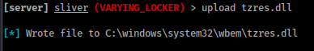

# Access

# Enumeration

## nmap

```
# Nmap 7.94SVN scan initiated Wed Jul 17 15:56:54 2024 as: nmap -vv --reason -Pn -T4 -sV -sC --version-all -A --osscan-guess -p- -oN /home/hatto/CTF/Offsec/ProvinGrounds/Access/results/192.168.203.187/scans/_full_tcp_nmap.txt -oX /home/hatto/CTF/Offsec/ProvinGrounds/Access/results/192.168.203.187/scans/xml/_full_tcp_nmap.xml 192.168.203.187
Warning: Hit PCRE_ERROR_MATCHLIMIT when probing for service http with the regex '^HTTP/1\.1 \d\d\d (?:[^\r\n]*\r\n(?!\r\n))*?.*\r\nServer: Virata-EmWeb/R([\d_]+)\r\nContent-Type: text/html; ?charset=UTF-8\r\nExpires: .*<title>HP (Color |)LaserJet ([\w._ -]+)&nbsp;&nbsp;&nbsp;'
Nmap scan report for 192.168.203.187
Host is up, received user-set (0.096s latency).
Scanned at 2024-07-17 15:56:54 JST for 222s
Not shown: 65516 filtered tcp ports (no-response)
PORT      STATE SERVICE       REASON          VERSION
53/tcp    open  domain        syn-ack ttl 125 Simple DNS Plus
80/tcp    open  http          syn-ack ttl 125 Apache httpd 2.4.48 ((Win64) OpenSSL/1.1.1k PHP/8.0.7)
|_http-favicon: Unknown favicon MD5: FED84E16B6CCFE88EE7FFAAE5DFEFD34
|_http-server-header: Apache/2.4.48 (Win64) OpenSSL/1.1.1k PHP/8.0.7
|_http-title: Access The Event
| http-methods: 
|   Supported Methods: POST OPTIONS HEAD GET TRACE
|_  Potentially risky methods: TRACE
135/tcp   open  msrpc         syn-ack ttl 125 Microsoft Windows RPC
139/tcp   open  netbios-ssn   syn-ack ttl 125 Microsoft Windows netbios-ssn
389/tcp   open  ldap          syn-ack ttl 125 Microsoft Windows Active Directory LDAP (Domain: access.offsec0., Site: Default-First-Site-Name)
445/tcp   open  microsoft-ds? syn-ack ttl 125
464/tcp   open  kpasswd5?     syn-ack ttl 125
593/tcp   open  ncacn_http    syn-ack ttl 125 Microsoft Windows RPC over HTTP 1.0
636/tcp   open  tcpwrapped    syn-ack ttl 125
3268/tcp  open  ldap          syn-ack ttl 125 Microsoft Windows Active Directory LDAP (Domain: access.offsec0., Site: Default-First-Site-Name)
3269/tcp  open  tcpwrapped    syn-ack ttl 125
5985/tcp  open  http          syn-ack ttl 125 Microsoft HTTPAPI httpd 2.0 (SSDP/UPnP)
|_http-title: Not Found
|_http-server-header: Microsoft-HTTPAPI/2.0
9389/tcp  open  mc-nmf        syn-ack ttl 125 .NET Message Framing
49666/tcp open  msrpc         syn-ack ttl 125 Microsoft Windows RPC
49668/tcp open  msrpc         syn-ack ttl 125 Microsoft Windows RPC
49673/tcp open  ncacn_http    syn-ack ttl 125 Microsoft Windows RPC over HTTP 1.0
49674/tcp open  msrpc         syn-ack ttl 125 Microsoft Windows RPC
49677/tcp open  msrpc         syn-ack ttl 125 Microsoft Windows RPC
49704/tcp open  msrpc         syn-ack ttl 125 Microsoft Windows RPC
Warning: OSScan results may be unreliable because we could not find at least 1 open and 1 closed port
OS fingerprint not ideal because: Missing a closed TCP port so results incomplete
No OS matches for host
TCP/IP fingerprint:
SCAN(V=7.94SVN%E=4%D=7/17%OT=53%CT=%CU=%PV=Y%DS=4%DC=T%G=N%TM=66976C14%P=x86_64-pc-linux-gnu)
SEQ(SP=106%GCD=1%ISR=108%TI=I%TS=U)
OPS(O1=M551NW8NNS%O2=M551NW8NNS%O3=M551NW8%O4=M551NW8NNS%O5=M551NW8NNS%O6=M551NNS)
WIN(W1=FFFF%W2=FFFF%W3=FFFF%W4=FFFF%W5=FFFF%W6=FF70)
ECN(R=Y%DF=Y%TG=80%W=FFFF%O=M551NW8NNS%CC=Y%Q=)
T1(R=Y%DF=Y%TG=80%S=O%A=S+%F=AS%RD=0%Q=)
T2(R=N)
T3(R=N)
T4(R=N)
U1(R=N)
IE(R=N)

Network Distance: 4 hops
TCP Sequence Prediction: Difficulty=262 (Good luck!)
IP ID Sequence Generation: Incremental
Service Info: Host: SERVER; OS: Windows; CPE: cpe:/o:microsoft:windows

Host script results:
|_clock-skew: 0s
| smb2-time: 
|   date: 2024-07-17T06:59:58
|_  start_date: N/A
| smb2-security-mode: 
|   3:1:1: 
|_    Message signing enabled and required
| p2p-conficker: 
|   Checking for Conficker.C or higher...
|   Check 1 (port 47055/tcp): CLEAN (Timeout)
|   Check 2 (port 61659/tcp): CLEAN (Timeout)
|   Check 3 (port 24589/udp): CLEAN (Timeout)
|   Check 4 (port 25678/udp): CLEAN (Timeout)
|_  0/4 checks are positive: Host is CLEAN or ports are blocked

TRACEROUTE (using port 135/tcp)
HOP RTT      ADDRESS
1   96.36 ms 192.168.45.1
2   96.32 ms 192.168.45.254
3   96.77 ms 192.168.251.1
4   96.78 ms 192.168.203.187

Read data files from: /usr/bin/../share/nmap
OS and Service detection performed. Please report any incorrect results at https://nmap.org/submit/ .
# Nmap done at Wed Jul 17 16:00:36 2024 -- 1 IP address (1 host up) scanned in 221.51 seconds
```

スキャン結果から Active Directory であることがわかる

## DNS


domainをhostsファイルに追加

```
192.168.203.187	access.offsec server.access.offsec
```

## File Upload


サイトを探索しているとファイルのアップロードフォームを見つけた


ディレクトリ探索をすると `/uploads` フォルダが見つかった。おそらくアップロードしたファイルがuplaodsフォルダに保存されるっぽい。


試しにphpファイルをアップロードしてみる


phpの拡張子は許可されていないらしい

適当な拡張子で送信してみると問題なくアップロードすることができた


.htaccess で拡張子をレンタリングする


作成した.htaccessファイルをアップロードする


アップロードできた

phpリバースシェルを作成し、拡張子を.shellにして送信する


アップロードできた

`netcat` で待ち受けを作成してuploadsフォルダからshell.shellにアクセスする


# Sliver C2


C2 sessionを確立するためsliverを起動してインプラントを作成、リスナーを起動しておく

Cドライブ直下にtempフォルダを作成してダウンロード


ダウンロードしたファイルを実行する


C2 sessionを確立できた

# 横移動(svc_appche > svc_mssql)

`C:\Users` フォルダで `svc_mssql` ユーザーを見つけた。まずこのユーザーに横移動する必要がありそう


powerviewをアップロードしておく


Sliver C2の機能であるRubeusを使用してkerberoastingを実行するとkerveroast hashを取得できた


取得したハッシュ値をファイルに保存してhashcatで解析する


解析に成功しパスワードが `trustno1` であることがわかった。


ユーザー `svc_mssql` ではevli-winrmは使用できなかった。


smb共有にアクセスすることができるのでアクセスして調べてみたがなにも興味深いものはなかった。

資格情報があるのでRunasCsを使用して横移動する

svc_mssqlようにインプラントを作成してアップロード


RunasCsをアップロード


セッションをバックグラウンドにしておく


RunasCsでインプラント実行する


svc_mssqlのセッションを確立できた


local.txtを取得

# 垂直移動 (svc_mssql > Administrator)

セッションに接続し持っている権限をしらべる


`SeManageVolumePrivilege` 権限を持っていることが分かった

`SeManageVolumePrivilege` は、ボリュームメンテナンスタスクを実行するためのユーザーサービス権限を許可する。これにより、ディスク上のユーザー権限の割り当てを変更できるようになる。

以下のエクスプロイトスクリプトを実行すると、Cドライブを完全に制御できるようになり、C:\内の任意のファイルに書き込むことができるようになる。

[SeManageVolumeExploit](https://github.com/CsEnox/SeManageVolumeExploit)

スクリプトをアップロード


スクリプトを実行する


## DLL Hijacking

C:\ ドライブ内の任意のファイルに書き込むことができるようになったので。まず、msfvenom でリバース シェルを隠すために使用する .dll ファイルを作成し、`tzres.dll` という名前を付ける (`systeminfo` コマンドの実行時にトリガーされる dll ファイル)。


`tzres.dll` をターゲットにアップロードする



リスナーを起動してターゲットマシンで `systeminfo` コマンドを実行する


シェルを取得することができた


proof.txtを取得