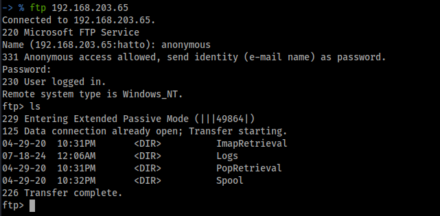
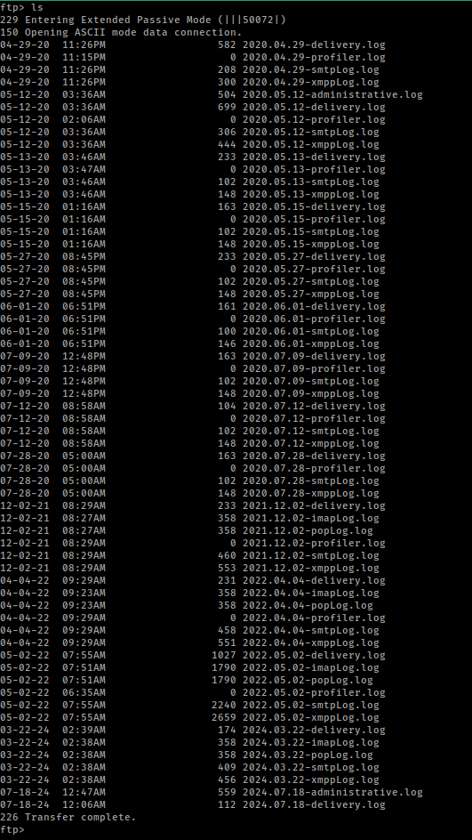
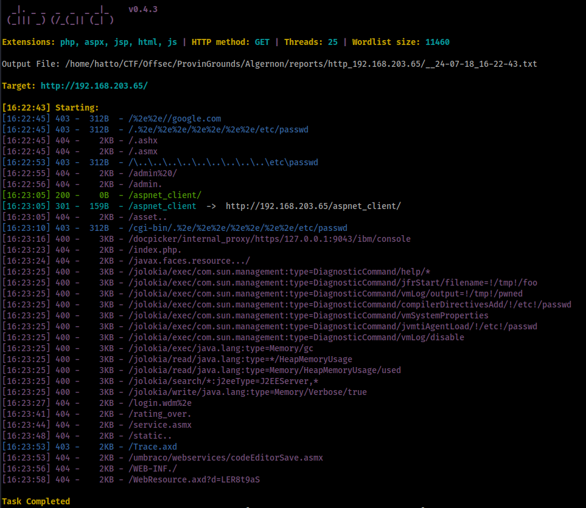
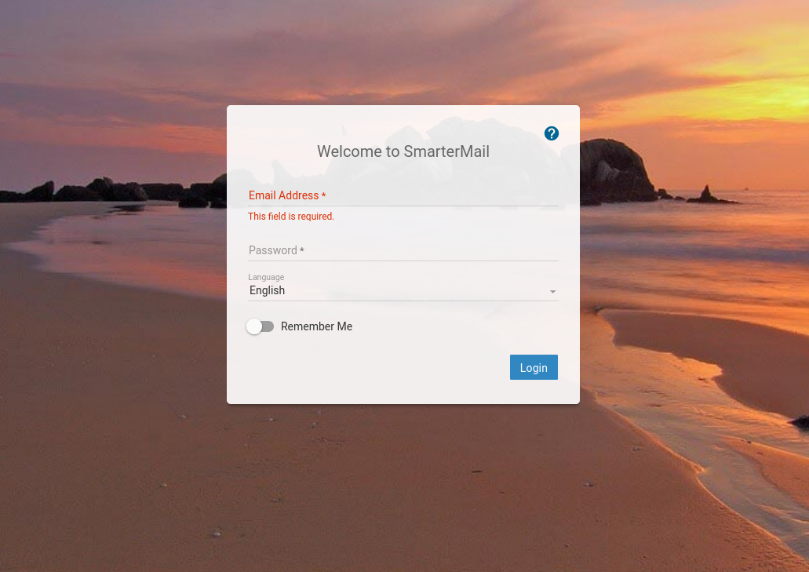
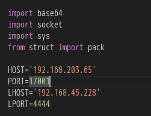
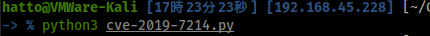
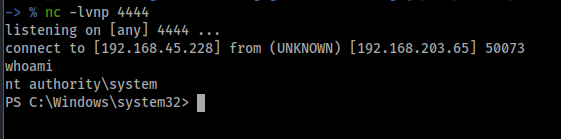
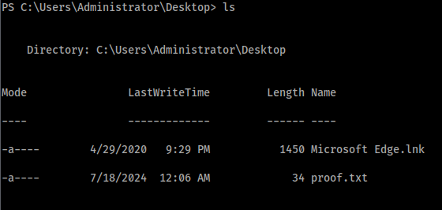

# Algernon

# Enumeration

## nmap

```
# Nmap 7.94SVN scan initiated Thu Jul 18 16:07:35 2024 as: nmap -vv --reason -Pn -T4 -sV -sC --version-all -A --osscan-guess -p- -oN /home/hatto/CTF/Offsec/ProvinGrounds/Algernon/results/192.168.203.65/scans/_full_tcp_nmap.txt -oX /home/hatto/CTF/Offsec/ProvinGrounds/Algernon/results/192.168.203.65/scans/xml/_full_tcp_nmap.xml 192.168.203.65
Increasing send delay for 192.168.203.65 from 0 to 5 due to 281 out of 701 dropped probes since last increase.
Increasing send delay for 192.168.203.65 from 5 to 10 due to 14 out of 34 dropped probes since last increase.
Warning: 192.168.203.65 giving up on port because retransmission cap hit (6).
Nmap scan report for 192.168.203.65
Host is up, received user-set (0.096s latency).
Scanned at 2024-07-18 16:07:35 JST for 1338s
Not shown: 65414 closed tcp ports (reset), 107 filtered tcp ports (no-response)
PORT      STATE SERVICE       REASON          VERSION
21/tcp    open  ftp           syn-ack ttl 125 Microsoft ftpd
| ftp-anon: Anonymous FTP login allowed (FTP code 230)
| 04-29-20  10:31PM       <DIR>          ImapRetrieval
| 07-18-24  12:06AM       <DIR>          Logs
| 04-29-20  10:31PM       <DIR>          PopRetrieval
|_04-29-20  10:32PM       <DIR>          Spool
| ftp-syst: 
|_  SYST: Windows_NT
80/tcp    open  http          syn-ack ttl 125 Microsoft IIS httpd 10.0
|_http-server-header: Microsoft-IIS/10.0
|_http-title: IIS Windows
| http-methods: 
|   Supported Methods: OPTIONS TRACE GET HEAD POST
|_  Potentially risky methods: TRACE
135/tcp   open  msrpc         syn-ack ttl 125 Microsoft Windows RPC
139/tcp   open  netbios-ssn   syn-ack ttl 125 Microsoft Windows netbios-ssn
445/tcp   open  microsoft-ds? syn-ack ttl 125
5040/tcp  open  unknown       syn-ack ttl 125
9998/tcp  open  http          syn-ack ttl 125 Microsoft IIS httpd 10.0
|_http-server-header: Microsoft-IIS/10.0
|_http-favicon: Unknown favicon MD5: 9D7294CAAB5C2DF4CD916F53653714D5
| uptime-agent-info: HTTP/1.1 400 Bad Request\x0D
| Content-Type: text/html; charset=us-ascii\x0D
| Server: Microsoft-HTTPAPI/2.0\x0D
| Date: Thu, 18 Jul 2024 07:29:36 GMT\x0D
| Connection: close\x0D
| Content-Length: 326\x0D
| \x0D
| <!DOCTYPE HTML PUBLIC "-//W3C//DTD HTML 4.01//EN""http://www.w3.org/TR/html4/strict.dtd">\x0D
| <HTML><HEAD><TITLE>Bad Request</TITLE>\x0D
| <META HTTP-EQUIV="Content-Type" Content="text/html; charset=us-ascii"></HEAD>\x0D
| <BODY><h2>Bad Request - Invalid Verb</h2>\x0D
| <hr><p>HTTP Error 400. The request verb is invalid.</p>\x0D
|_</BODY></HTML>\x0D
| http-methods: 
|_  Supported Methods: GET HEAD POST OPTIONS
| http-title: Site doesn't have a title (text/html; charset=utf-8).
|_Requested resource was /interface/root
17001/tcp open  remoting      syn-ack ttl 125 MS .NET Remoting services
49664/tcp open  msrpc         syn-ack ttl 125 Microsoft Windows RPC
49665/tcp open  msrpc         syn-ack ttl 125 Microsoft Windows RPC
49666/tcp open  msrpc         syn-ack ttl 125 Microsoft Windows RPC
49667/tcp open  msrpc         syn-ack ttl 125 Microsoft Windows RPC
49668/tcp open  msrpc         syn-ack ttl 125 Microsoft Windows RPC
49669/tcp open  msrpc         syn-ack ttl 125 Microsoft Windows RPC
OS fingerprint not ideal because: Didn't receive UDP response. Please try again with -sSU
No OS matches for host
TCP/IP fingerprint:
SCAN(V=7.94SVN%E=4%D=7/18%OT=21%CT=1%CU=%PV=Y%DS=4%DC=T%G=N%TM=6698C471%P=x86_64-pc-linux-gnu)
SEQ(SP=103%GCD=1%ISR=10C%TS=U)
OPS(O1=M551NW8NNS%O2=M551NW8NNS%O3=M551NW8%O4=M551NW8NNS%O5=%O6=M551NNS)
WIN(W1=FFFF%W2=FFFF%W3=FFFF%W4=FFFF%W5=3FD%W6=FF70)
WIN(W1=FFFF%W2=FFFF%W3=FFFF%W4=FFFF%W5=402%W6=FF70)
ECN(R=N)
T1(R=Y%DF=Y%TG=80%S=O%A=S+%F=AS%RD=0%Q=)
T2(R=N)
T3(R=N)
T4(R=Y%DF=Y%TG=80%W=3FD%S=O%A=O%F=A%O=%RD=0%Q=)
T4(R=Y%DF=Y%TG=80%W=3FF%S=O%A=O%F=A%O=%RD=0%Q=)
T5(R=Y%DF=Y%TG=80%W=0%S=Z%A=S+%F=AR%O=%RD=0%Q=)
T6(R=N)
T7(R=N)
U1(R=N)
IE(R=N)

Network Distance: 4 hops
TCP Sequence Prediction: Difficulty=259 (Good luck!)
IP ID Sequence Generation: Busy server or unknown class
Service Info: OS: Windows; CPE: cpe:/o:microsoft:windows

Host script results:
| smb2-time: 
|   date: 2024-07-18T07:29:41
|_  start_date: N/A
| p2p-conficker: 
|   Checking for Conficker.C or higher...
|   Check 1 (port 46933/tcp): CLEAN (Couldn't connect)
|   Check 2 (port 39792/tcp): CLEAN (Couldn't connect)
|   Check 3 (port 32365/udp): CLEAN (Failed to receive data)
|   Check 4 (port 17965/udp): CLEAN (Timeout)
|_  0/4 checks are positive: Host is CLEAN or ports are blocked
|_clock-skew: -1s
| smb2-security-mode: 
|   3:1:1: 
|_    Message signing enabled but not required

TRACEROUTE (using port 1025/tcp)
HOP RTT      ADDRESS
1   95.62 ms 192.168.45.1
2   95.61 ms 192.168.45.254
3   96.60 ms 192.168.251.1
4   96.62 ms 192.168.203.65

Read data files from: /usr/bin/../share/nmap
OS and Service detection performed. Please report any incorrect results at https://nmap.org/submit/ .
# Nmap done at Thu Jul 18 16:29:53 2024 -- 1 IP address (1 host up) scanned in 1338.63 seconds
```

## ftp

ftpに匿名でログインできることが分かった。


ログインするといくつかディレクトリが見つかった



`Logs` 以外のディレクトリには何もなかった。



ログファイルしかなくすべてダウンロードして中を見てみたが、特に興味深いものはなかった。

## http

ディレクトリ探索をする



特に何もなかった。

port 9998 でwebサーバーが起動していたのでアクセスする



`SmarterMail` のログインページが表示された。

# Exploit

`SmarterMail` に既知の脆弱性がないか調べてみると以下のPoCを見つけた

[CVE-2019-7214](https://github.com/devzspy/CVE-2019-7214)

スクリプトの `HOST`, `LHOST` を設定する



設定したら実行



`nt authority\system` としてシェルを取得した





proof.txtを取得