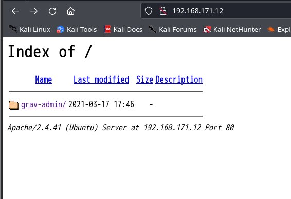
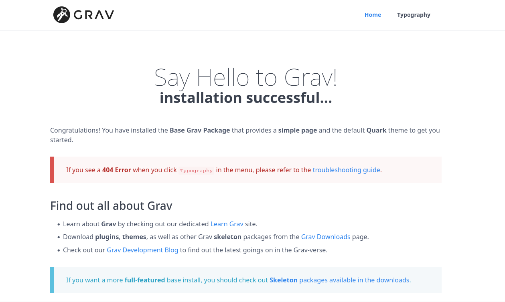
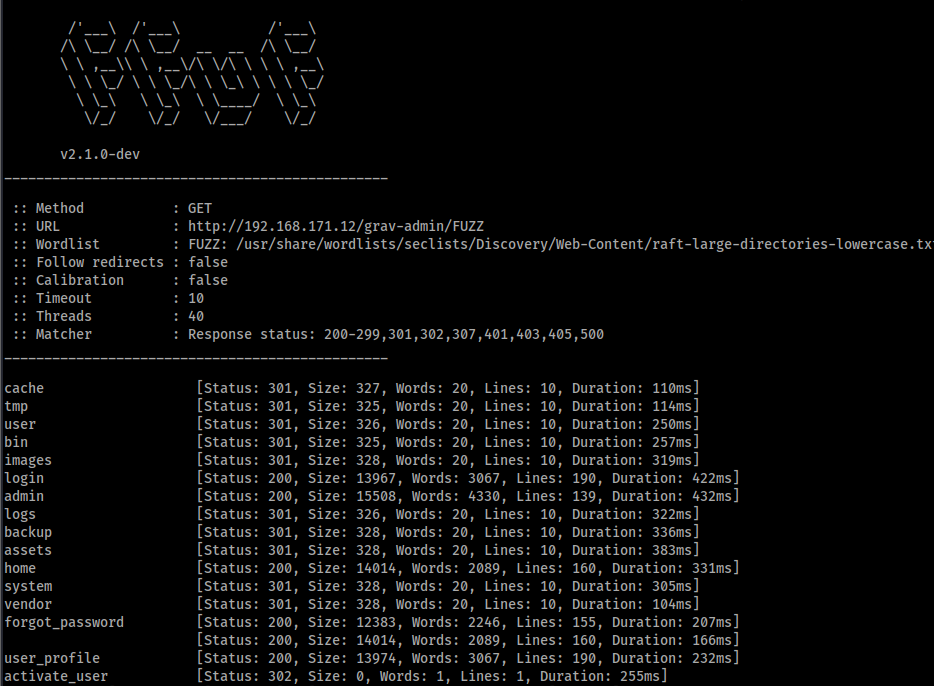
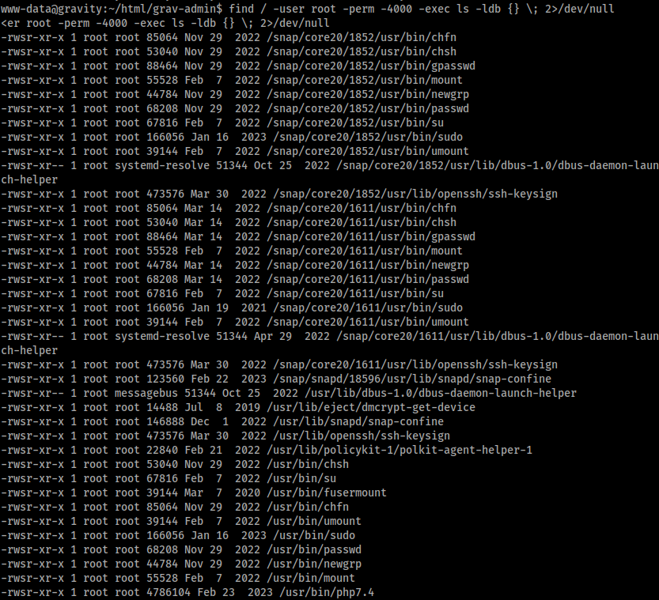
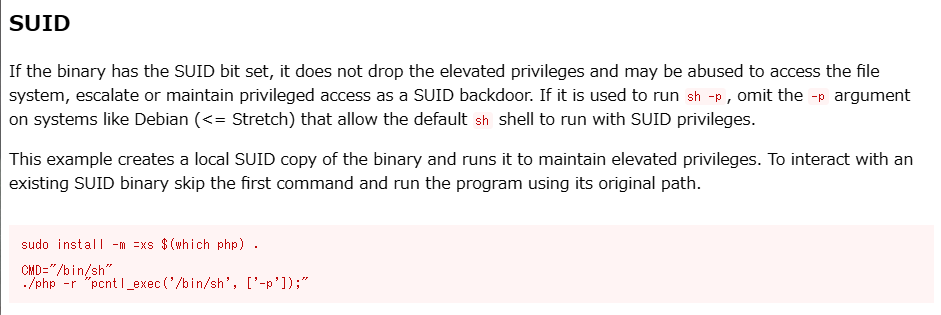
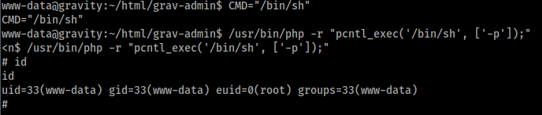
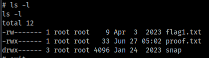

# Enumeration

## nmap

```
Starting Nmap 7.94SVN ( https://nmap.org ) at 2024-06-21 09:42 JST
NSE: Loaded 156 scripts for scanning.
NSE: Script Pre-scanning.
Initiating NSE at 09:42
Completed NSE at 09:42, 0.00s elapsed
Initiating NSE at 09:42
Completed NSE at 09:42, 0.00s elapsed
Initiating NSE at 09:42
Completed NSE at 09:42, 0.00s elapsed
Initiating SYN Stealth Scan at 09:42
Scanning 192.168.171.12 [65535 ports]
Discovered open port 22/tcp on 192.168.171.12
Discovered open port 80/tcp on 192.168.171.12
Completed SYN Stealth Scan at 09:42, 8.47s elapsed (65535 total ports)
Initiating Service scan at 09:42
Scanning 2 services on 192.168.171.12
Completed Service scan at 09:42, 6.22s elapsed (2 services on 1 host)
NSE: Script scanning 192.168.171.12.
Initiating NSE at 09:42
Completed NSE at 09:42, 2.93s elapsed
Initiating NSE at 09:42
Completed NSE at 09:42, 0.40s elapsed
Initiating NSE at 09:42
Completed NSE at 09:42, 0.00s elapsed
Nmap scan report for 192.168.171.12
Host is up (0.11s latency).
Not shown: 65533 closed tcp ports (reset)
PORT   STATE SERVICE VERSION
22/tcp open  ssh     OpenSSH 8.2p1 Ubuntu 4ubuntu0.5 (Ubuntu Linux; protocol 2.0)
| ssh-hostkey: 
|   3072 98:4e:5d:e1:e6:97:29:6f:d9:e0:d4:82:a8:f6:4f:3f (RSA)
|   256 57:23:57:1f:fd:77:06:be:25:66:61:14:6d:ae:5e:98 (ECDSA)
|_  256 c7:9b:aa:d5:a6:33:35:91:34:1e:ef:cf:61:a8:30:1c (ED25519)
80/tcp open  http    Apache httpd 2.4.41
|_http-title: Index of /
|_http-server-header: Apache/2.4.41 (Ubuntu)
| http-ls: Volume /
| SIZE  TIME              FILENAME
| -     2021-03-17 17:46  grav-admin/
|_
| http-methods: 
|_  Supported Methods: HEAD GET POST OPTIONS
Service Info: Host: 127.0.0.1; OS: Linux; CPE: cpe:/o:linux:linux_kernel

NSE: Script Post-scanning.
Initiating NSE at 09:42
Completed NSE at 09:42, 0.00s elapsed
Initiating NSE at 09:42
Completed NSE at 09:42, 0.00s elapsed
Initiating NSE at 09:42
Completed NSE at 09:42, 0.00s elapsed
Read data files from: /usr/bin/../share/nmap
Service detection performed. Please report any incorrect results at https://nmap.org/submit/ .
Nmap done: 1 IP address (1 host up) scanned in 18.45 seconds
           Raw packets sent: 82109 (3.613MB) | Rcvd: 68368 (2.735MB)
```

22,80番ポートが開いていることが分かった80番ポートから見ていく

## Grav

index.htmlがないらしい



`grab-admin`というフォルダがあるので見てみる



GravCMSの初期画面が出てきた<br>GravCMSはMarkDown形式のWebサイトを作ることができるCMS

ディレクトリの探索をしてみる



adminページが見つかったのでアクセスする


# Exploit

デフォルトパスワードが使えないか探したが見つからなかった。<br>PoCがないか調べてみると以下のPoCを見つけた。<br>[CVE-2021-21425](https://github.com/CsEnox/CVE-2021-21425)

リバースシェルを入れて実行してみる


シェルが返ってきた


# Privilege Escalation

## SUID

SUIDが付与されているバイナリを列挙してみる



`/usr/bin/php7.4` というバイナリを見つけた<br>
GTFObinsで調べてみる
[./php](https://gtfobins.github.io/gtfobins/php/)



このコマンドの通りに実行してみる



rootになれた



rootフラグゲット