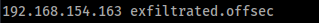

# Enumeration

## nmap

```
# Nmap 7.94SVN scan initiated Sat Jun 22 08:00:20 2024 as: nmap -vv --reason -Pn -T4 -sV -sC --version-all -A --osscan-guess -p- -oN /home/hatto/CTF/Offsec/OSCP/lab/Exfiltrated/results/192.168.154.163/scans/_full_tcp_nmap.txt -oX /home/hatto/CTF/Offsec/OSCP/lab/Exfiltrated/results/192.168.154.163/scans/xml/_full_tcp_nmap.xml 192.168.154.163
Nmap scan report for 192.168.154.163
Host is up, received user-set (0.096s latency).
Scanned at 2024-06-22 08:00:20 JST for 108s
Not shown: 65533 closed tcp ports (reset)
PORT   STATE SERVICE REASON         VERSION
22/tcp open  ssh     syn-ack ttl 61 OpenSSH 8.2p1 Ubuntu 4ubuntu0.2 (Ubuntu Linux; protocol 2.0)
| ssh-hostkey: 
|   3072 c1:99:4b:95:22:25:ed:0f:85:20:d3:63:b4:48:bb:cf (RSA)
| ssh-rsa AAAAB3NzaC1yc2EAAAADAQABAAABgQDH6PH1/ST7TUJ4Mp/l4c7G+TM07YbX7YIsnHzq1TRpvtiBh8MQuFkL1SWW9+za+h6ZraqoZ0ewwkH+0la436t9Q+2H/Nh4CntJOrRbpLJKg4hChjgCHd5KiLCOKHhXPs/FA3mm0Zkzw1tVJLPR6RTbIkkbQiV2Zk3u8oamV5srWIJeYUY5O2XXmTnKENfrPXeHup1+3wBOkTO4Mu17wBSw6yvXyj+lleKjQ6Hnje7KozW5q4U6ijd3LmvHE34UHq/qUbCUbiwY06N2Mj0NQiZqWW8z48eTzGsuh6u1SfGIDnCCq3sWm37Y5LIUvqAFyIEJZVsC/UyrJDPBE+YIODNbN2QLD9JeBr8P4n1rkMaXbsHGywFtutdSrBZwYuRuB2W0GjIEWD/J7lxKIJ9UxRq0UxWWkZ8s3SNqUq2enfPwQt399nigtUerccskdyUD0oRKqVnhZCjEYfX3qOnlAqejr3Lpm8nA31pp6lrKNAmQEjdSO8Jxk04OR2JBxcfVNfs=
|   256 0f:44:8b:ad:ad:95:b8:22:6a:f0:36:ac:19:d0:0e:f3 (ECDSA)
| ecdsa-sha2-nistp256 AAAAE2VjZHNhLXNoYTItbmlzdHAyNTYAAAAIbmlzdHAyNTYAAABBBI0EdIHR7NOReMM0G7C8zxbLgwB3ump+nb2D3Pe3tXqp/6jNJ/GbU2e4Ab44njMKHJbm/PzrtYzojMjGDuBlQCg=
|   256 32:e1:2a:6c:cc:7c:e6:3e:23:f4:80:8d:33:ce:9b:3a (ED25519)
|_ssh-ed25519 AAAAC3NzaC1lZDI1NTE5AAAAIDCc0saExmeDXtqm5FS+D5RnDke8aJEvFq3DJIr0KZML
80/tcp open  http    syn-ack ttl 61 Apache httpd 2.4.41 ((Ubuntu))
| http-methods: 
|_  Supported Methods: GET HEAD POST OPTIONS
|_http-title: Did not follow redirect to http://exfiltrated.offsec/
| http-robots.txt: 7 disallowed entries 
| /backup/ /cron/? /front/ /install/ /panel/ /tmp/ 
|_/updates/
|_http-favicon: Unknown favicon MD5: 09BDDB30D6AE11E854BFF82ED638542B
|_http-server-header: Apache/2.4.41 (Ubuntu)
Aggressive OS guesses: Linux 2.6.32 (88%), Linux 2.6.39 (88%), Linux 3.10 - 3.12 (88%), Linux 3.4 (88%), Linux 3.5 (88%), Linux 4.4 (88%), Synology DiskStation Manager 5.1 (88%), WatchGuard Fireware 11.8 (88%), Linux 2.6.35 (87%), Linux 3.10 (87%)
No exact OS matches for host (If you know what OS is running on it, see https://nmap.org/submit/ ).
TCP/IP fingerprint:
OS:SCAN(V=7.94SVN%E=4%D=6/22%OT=22%CT=1%CU=43807%PV=Y%DS=4%DC=T%G=Y%TM=6676
OS:0670%P=x86_64-pc-linux-gnu)SEQ(SP=105%GCD=1%ISR=10C%TI=Z%II=I%TS=A)OPS(O
OS:1=M551ST11NW7%O2=M551ST11NW7%O3=M551NNT11NW7%O4=M551ST11NW7%O5=M551ST11N
OS:W7%O6=M551ST11)WIN(W1=FE88%W2=FE88%W3=FE88%W4=FE88%W5=FE88%W6=FE88)ECN(R
OS:=Y%DF=Y%T=40%W=FAF0%O=M551NNSNW7%CC=Y%Q=)T1(R=Y%DF=Y%T=40%S=O%A=S+%F=AS%
OS:RD=0%Q=)T2(R=N)T3(R=N)T4(R=N)T5(R=Y%DF=Y%T=40%W=0%S=Z%A=S+%F=AR%O=%RD=0%
OS:Q=)T6(R=N)T7(R=N)U1(R=Y%DF=N%T=40%IPL=164%UN=0%RIPL=G%RID=G%RIPCK=G%RUCK
OS:=9A45%RUD=G)IE(R=Y%DFI=N%T=40%CD=S)

Uptime guess: 20.956 days (since Sat Jun  1 09:06:02 2024)
Network Distance: 4 hops
TCP Sequence Prediction: Difficulty=261 (Good luck!)
IP ID Sequence Generation: All zeros
Service Info: OS: Linux; CPE: cpe:/o:linux:linux_kernel

TRACEROUTE (using port 23/tcp)
HOP RTT      ADDRESS
1   95.33 ms 192.168.45.1
2   95.27 ms 192.168.45.254
3   95.36 ms 192.168.251.1
4   95.62 ms 192.168.154.163

Read data files from: /usr/bin/../share/nmap
OS and Service detection performed. Please report any incorrect results at https://nmap.org/submit/ .
# Nmap done at Sat Jun 22 08:02:08 2024 -- 1 IP address (1 host up) scanned in 109.03 seconds
```

nmapの情報からウェブサイトの`exfiltrated.offsec`というリダイレクト先を見つけたのでhostsファイルに追加する



WebサイトにアクセスるとSubrion CMS というウェブベースのコンテンツ管理システムを使用したサイトが出てきた

niktoでスキャンしてみる

```
- Nikto v2.5.0
---------------------------------------------------------------------------
+ Target IP:          192.168.154.163
+ Target Hostname:    192.168.154.163
+ Target Port:        80
+ Start Time:         2024-06-22 08:00:40 (GMT9)
---------------------------------------------------------------------------
+ Server: Apache/2.4.41 (Ubuntu)
+ /: Cookie INTELLI_06c8042c3d created without the httponly flag. See: https://developer.mozilla.org/en-US/docs/Web/HTTP/Cookies
+ /: The anti-clickjacking X-Frame-Options header is not present. See: https://developer.mozilla.org/en-US/docs/Web/HTTP/Headers/X-Frame-Options
+ /: The X-Content-Type-Options header is not set. This could allow the user agent to render the content of the site in a different fashion to the MIME type. See: https://www.netsparker.com/web-vulnerability-scanner/vulnerabilities/missing-content-type-header/
+ Root page / redirects to: http://exfiltrated.offsec/
+ All CGI directories 'found', use '-C none' to test none
+ /robots.txt: Entry '/panel/' is returned a non-forbidden or redirect HTTP code (200). See: https://portswigger.net/kb/issues/00600600_robots-txt-file
+ /robots.txt: contains 7 entries which should be manually viewed. See: https://developer.mozilla.org/en-US/docs/Glossary/Robots.txt
+ Apache/2.4.41 appears to be outdated (current is at least Apache/2.4.54). Apache 2.2.34 is the EOL for the 2.x branch.
```

/panelというページがあることが分かったのでアクセスする


ログインページとSubrion CMS のバージョン情報を取得した

適当に`admin:admin`でログインできるどうか試すとログインに成功した


googleでSubrion 4.2.1のRCEがないか調べると以下のPoCを見つけた
[CVE-2018-19422-SubrionCMS-RCE](https://github.com/hev0x/CVE-2018-19422-SubrionCMS-RCE.git)
# Exploit

READMEの通り、ターゲットURLと`admin:admin`の認証情報を使用して実行する

![[/screenshot/Pasted image 20240622084510.png]]

www-dataとしてRCEを実行できるようになった

![[screenshot/Pasted image 20240622130240.png]]

local.txtゲット
しかし、このシェルは実際のシェルではないため実際のシェルに接続する必要がある。

![[screenshot/Pasted image 20240622142554.png]]

pythonのリバースシェル使用する

![[Pasted image 20240622142618.png]]

これで本物のシェルお奪うことができた
# # Privilege Escalation

Linpeasをダウンロードし実行した

![[screenshot/Pasted image 20240622151622.png]]

## SetSUID Pkexec Privilege Escalation

SUIDのついたバイナリをしらべる

![[screenshot/Pasted image 20240622160555.png]]

pkexecにSUIDが付与されていることが分かった
pkexecにSUIDが付与されている場合以下のPoCを使用することで権限の昇格を行える
[CVE-2021-4034 - Pkexec Local Privilege Escalation](https://github.com/ly4k/PwnKit)

![[screenshot/Pasted image 20240622160227.png]]

rootになれた

## Cronjob Privilege Escalation

crontabに`bash /opt/image-exif.sh`というシェルスクリプトが定期的に実行されていることが分かった。

スクリプトを見てみる

```
#! /bin/bash
#07/06/18 A BASH script to collect EXIF metadata 

echo -ne "\\n metadata directory cleaned! \\n\\n"


IMAGES='/var/www/html/subrion/uploads'

META='/opt/metadata'
FILE=`openssl rand -hex 5`
LOGFILE="$META/$FILE"

echo -ne "\\n Processing EXIF metadata now... \\n\\n"
ls $IMAGES | grep "jpg" | while read filename; 
do 
    exiftool "$IMAGES/$filename" >> $LOGFILE 
done

echo -ne "\\n\\n Processing is finished! \\n\\n\\n"
```

exiftoolの脆弱性について調べていると以下の記事を見つけた<br>[ExifTool 12.23 – Arbitrary Code Execution – (Privilege escalation) – CVE-2021-22204](https://vk9-sec.com/exiftool-12-23-arbitrary-code-execution-privilege-escalation-cve-2021-22204/)

exiftool version 7.44から12.23にはDjVu ファイル形式のユーザー データの不適切な無力化が原因で、ローカルの攻撃者がシステム上で任意のコードを実行できるらしい

![[screenshot/Pasted image 20240622161258.png]]

インストールされているexiftoolのバージョンから`11.88`なので子の脆弱性を悪用することで権限の昇格が行えそう

この記事の通りにやってみる
### Exploit

以下の内容の`exploit.sh`と`paylaod`ファイルを作成する

![[screenshot/Pasted image 20240622162116.png]]

以下のコマンドを実行しdjvuファイルを作成

![[screenshot/Pasted image 20240622162245.png]]

作成したdjvuファイルをjpgに変更

![[Pasted image 20240622162327.png]]

攻撃者側でWebサーバとシェルの待ち受けを起動しターゲットマシンから`exploit.jpg`をダウンロード

![[screenshot/Pasted image 20240622162450.png]]

cranjobが実行されるまで少し待っていると...

![[screenshot/Pasted image 20240622162624.png]]

rootのシェルを奪えた

![[screenshot/Pasted image 20240622162734.png]]

rootフラグもゲット

### Exploit (Metasploit)

metasploitに同じようなモジュール`exploit/unix/fileformat/exiftool_djvu_ant_perl_injection`があったので試してみる

モジュールを選択肢LHOSTを設定

![[screenshot/Pasted image 20240622163637.png]]

exploitを実行し`msf.jpg`を作成(msf.jpgは~/.msf4/local/に作成される)

![[screenshot/Pasted image 20240622163807.png]]

multi/handlerで待ち受ける

![[screenshot/Pasted image 20240622163941.png]]

ターゲットマシンに`msf.jpg`をアップロードしリスナーを起動させる

![[screenshot/Pasted image 20240622164126.png]]

セッションが確立されrootのシェルに接続が成功した

![[screenshot/Pasted image 20240622164209.png]]