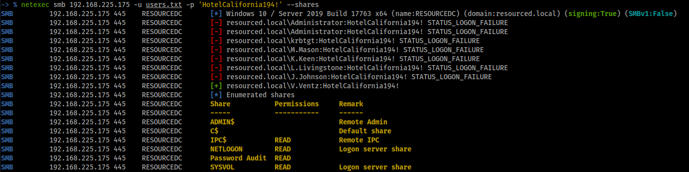

# Resourced

# Enumeration

## nmap

```
# Nmap 7.94SVN scan initiated Sat Jul  6 20:19:53 2024 as: nmap -vv --reason -Pn -T4 -sV -sC --version-all -A --osscan-guess -p- -oN /home/hatto/CTF/Offsec/ProvinGrounds/Resourced/results/192.168.225.175/scans/_full_tcp_nmap.txt -oX /home/hatto/CTF/Offsec/ProvinGrounds/Resourced/results/192.168.225.175/scans/xml/_full_tcp_nmap.xml 192.168.225.175
Nmap scan report for 192.168.225.175
Host is up, received user-set (0.096s latency).
Scanned at 2024-07-06 20:19:53 JST for 202s
Not shown: 65515 filtered tcp ports (no-response)
PORT      STATE SERVICE       REASON          VERSION
53/tcp    open  domain        syn-ack ttl 125 Simple DNS Plus
88/tcp    open  kerberos-sec  syn-ack ttl 125 Microsoft Windows Kerberos (server time: 2024-07-06 11:21:31Z)
135/tcp   open  msrpc         syn-ack ttl 125 Microsoft Windows RPC
139/tcp   open  netbios-ssn   syn-ack ttl 125 Microsoft Windows netbios-ssn
389/tcp   open  ldap          syn-ack ttl 125 Microsoft Windows Active Directory LDAP (Domain: resourced.local0., Site: Default-First-Site-Name)
445/tcp   open  microsoft-ds? syn-ack ttl 125
464/tcp   open  kpasswd5?     syn-ack ttl 125
593/tcp   open  ncacn_http    syn-ack ttl 125 Microsoft Windows RPC over HTTP 1.0
636/tcp   open  tcpwrapped    syn-ack ttl 125
3268/tcp  open  ldap          syn-ack ttl 125 Microsoft Windows Active Directory LDAP (Domain: resourced.local0., Site: Default-First-Site-Name)
3269/tcp  open  tcpwrapped    syn-ack ttl 125
3389/tcp  open  ms-wbt-server syn-ack ttl 125 Microsoft Terminal Services
| rdp-ntlm-info: 
|   Target_Name: resourced
|   NetBIOS_Domain_Name: resourced
|   NetBIOS_Computer_Name: RESOURCEDC
|   DNS_Domain_Name: resourced.local
|   DNS_Computer_Name: ResourceDC.resourced.local
|   DNS_Tree_Name: resourced.local
|   Product_Version: 10.0.17763
|_  System_Time: 2024-07-06T11:22:32+00:00
| ssl-cert: Subject: commonName=ResourceDC.resourced.local
| Issuer: commonName=ResourceDC.resourced.local
| Public Key type: rsa
| Public Key bits: 2048
| Signature Algorithm: sha256WithRSAEncryption
| Not valid before: 2024-03-21T10:42:07
| Not valid after:  2024-09-20T10:42:07
| MD5:   7643:1b81:d78e:cfa6:c007:754d:83ef:11ca
| SHA-1: 0c70:08f9:df37:ff1c:4682:7898:173d:220b:a891:b040
| -----BEGIN CERTIFICATE-----
| MIIC+DCCAeCgAwIBAgIQWODT06i3879ClVY4aBNFTTANBgkqhkiG9w0BAQsFADAl
| MSMwIQYDVQQDExpSZXNvdXJjZURDLnJlc291cmNlZC5sb2NhbDAeFw0yNDAzMjEx
| MDQyMDdaFw0yNDA5MjAxMDQyMDdaMCUxIzAhBgNVBAMTGlJlc291cmNlREMucmVz
| b3VyY2VkLmxvY2FsMIIBIjANBgkqhkiG9w0BAQEFAAOCAQ8AMIIBCgKCAQEAwQUs
| A4/zvP7ZCbyteV9VLi3sT4ZVyDVZp+6FsmpAP7tYeho867ohS8uZlZtIHJL+oxKj
| myWoahVdZVPF49vOYk19URrJDqBYGAtJjSuDDNp+qB7L+XV3XBMCAV3LI3Qhd+st
| WYLg+0b7PFIFt7t0u8MwaDPziM5j54pz1qPji6QowHFJu10xlwSzIUYBHQZOtbit
| 323r9i9L4hctE40EBsR9+On1u8pvcDiwRLwQyLIPkQsimcnc7ifm0ABsdf8pR9wh
| b+7eWNvMpEIJvby6WdKrJy/+NpovyKmqQUbcqm6UcsDffTHM+gT/b3Lc+N1UVyQG
| 7kVZ2RLiVR3jdXtL5QIDAQABoyQwIjATBgNVHSUEDDAKBggrBgEFBQcDATALBgNV
| HQ8EBAMCBDAwDQYJKoZIhvcNAQELBQADggEBABCDhPDzqxvxG6tqnE2d1JgwtqMl
| bcMHqfZKZs8EJWgkdMfwWOm0AUJHtpJKppYFgKx8F+j0bMqI0fK87Zz3uEgtK2Kg
| Ig/lKctyEDOj9BX7ErpY8IXooLjwYOl802mR9MtPR0BIcEqEFKUfxhunoZ4C7RDn
| CxDhHaap5fBhHyyiTZCLxKN7m8Mkc/FVLSyz3QJvBM3maK0BeYBU1SgKjHvLETmS
| xt+yQpRQ4SWRgvdw12TbPg7y3Fn50IDzdljfw9AqGVJkiZuySYt4YtXIJrdvj4gF
| veeq2ip2EFbDFN3lj/P3Rb+3ePuKAYkIqnAMKZM7SbCaxCX1dAMB0xhiMEw=
|_-----END CERTIFICATE-----
|_ssl-date: 2024-07-06T11:23:12+00:00; 0s from scanner time.
5985/tcp  open  http          syn-ack ttl 125 Microsoft HTTPAPI httpd 2.0 (SSDP/UPnP)
|_http-title: Not Found
|_http-server-header: Microsoft-HTTPAPI/2.0
9389/tcp  open  mc-nmf        syn-ack ttl 125 .NET Message Framing
49666/tcp open  msrpc         syn-ack ttl 125 Microsoft Windows RPC
49667/tcp open  msrpc         syn-ack ttl 125 Microsoft Windows RPC
49674/tcp open  ncacn_http    syn-ack ttl 125 Microsoft Windows RPC over HTTP 1.0
49675/tcp open  msrpc         syn-ack ttl 125 Microsoft Windows RPC
49693/tcp open  msrpc         syn-ack ttl 125 Microsoft Windows RPC
49712/tcp open  msrpc         syn-ack ttl 125 Microsoft Windows RPC
Warning: OSScan results may be unreliable because we could not find at least 1 open and 1 closed port
OS fingerprint not ideal because: Missing a closed TCP port so results incomplete
No OS matches for host
TCP/IP fingerprint:
SCAN(V=7.94SVN%E=4%D=7/6%OT=53%CT=%CU=%PV=Y%DS=4%DC=T%G=N%TM=66892923%P=x86_64-pc-linux-gnu)
SEQ(SP=104%GCD=1%ISR=10A%TI=I%TS=U)
OPS(O1=M551NW8NNS%O2=M551NW8NNS%O3=M551NW8%O4=M551NW8NNS%O5=M551NW8NNS%O6=M551NNS)
WIN(W1=FFFF%W2=FFFF%W3=FFFF%W4=FFFF%W5=FFFF%W6=FF70)
ECN(R=Y%DF=Y%TG=80%W=FFFF%O=M551NW8NNS%CC=Y%Q=)
T1(R=Y%DF=Y%TG=80%S=O%A=S+%F=AS%RD=0%Q=)
T2(R=N)
T3(R=N)
T4(R=N)
U1(R=N)
IE(R=N)

Network Distance: 4 hops
TCP Sequence Prediction: Difficulty=260 (Good luck!)
IP ID Sequence Generation: Incremental
Service Info: Host: RESOURCEDC; OS: Windows; CPE: cpe:/o:microsoft:windows

Host script results:
| smb2-time: 
|   date: 2024-07-06T11:22:34
|_  start_date: N/A
| smb2-security-mode: 
|   3:1:1: 
|_    Message signing enabled and required
| p2p-conficker: 
|   Checking for Conficker.C or higher...
|   Check 1 (port 18706/tcp): CLEAN (Timeout)
|   Check 2 (port 20296/tcp): CLEAN (Timeout)
|   Check 3 (port 17040/udp): CLEAN (Timeout)
|   Check 4 (port 41852/udp): CLEAN (Timeout)
|_  0/4 checks are positive: Host is CLEAN or ports are blocked
|_clock-skew: mean: 0s, deviation: 0s, median: 0s

TRACEROUTE (using port 53/tcp)
HOP RTT      ADDRESS
1   97.02 ms 192.168.45.1
2   96.58 ms 192.168.45.254
3   96.80 ms 192.168.251.1
4   96.86 ms 192.168.225.175

Read data files from: /usr/bin/../share/nmap
OS and Service detection performed. Please report any incorrect results at https://nmap.org/submit/ .
# Nmap done at Sat Jul  6 20:23:15 2024 -- 1 IP address (1 host up) scanned in 202.50 seconds

```

LDAP, Kerberos, kpasswd5サービスが稼働している。これらは通常、ドメインコントローラーが提供するサービスなのでこのマシンはActive Directoryのドメインコントローラーである可能性が高い

## enum4linux


ユーザーリストと `V.Ventz` のパスワードらしきものを見つけた

## SMB

取得したユーザーリストとパスワードでsmbにアクセスできるかためす



`V.Ventz` のみ有効であることが分かり共有ファイルにアクセスできることが分かった

smbclientで共有ファイルにアクセスして中のフォルダをすべてダウンロードする


`NETLOGON` には何も見つかなかった

`SYSVOL` にはフォルダが見つかり中にはファイルがあったが興味深いものは見つからなかった。

`Passowrd Audit` には`ntds.dit`, `ntds.jfm`, `SECURITY`, `SYSTEM` などの複数のファイルが見つかった。これらのファイルは`impacket-secretsdump`を使用することでパスワードハッシュを取得できる可能性がある。早速ダウンロードしてパスワードハッシュを抽出してみる。


## NTDS

impacket-secretsdumpでパスワードハッシュの抽出をするとユーザーのパスワードハッシュを取得することができた


以下のようにハッシュ値だけに加工する


netexecでwinrmで使用できるハッシュ値がないか調べる


使用できるユーザーとハッシュ値が見つかったのでevil-winrmでログインする


ログインできた


local.txtゲット

# Privilege Escalation

BloodHoundで列挙を行いたいのでSharpHoundをダウンロードして実行する


作成されたzipファイルをダウンロードする


BloodHound CE を起動しzipファイルを解凍してなかのjsonファイルをすべてアップロードする


ユーザー `L.Livingstone` がドメインコントローラーに対して `GenerricAll` の権限を持っていることが分かった。

これは `L.Livingstone` がドメインコントローラーに対する一般的なすべての権限を持っていることを意味している


この時、Kerberos リソース ベースの制約付き委任攻撃を実行することができる。これにより、基本的に特定のユーザー (管理者) になりすますことができる。

## RBCD（Resource-based Constrained Delegation）攻撃

RBCD攻撃とは、攻撃者がターゲットとなるActive Directoryへ侵入後、他の端末への侵入範囲拡大や、ドメインにおける権限昇格を行うための攻撃手法の1つ。これはActive Directoryにおける「[Resource-based Constrained Delegation（リソースベースの制約付き委任）](https://learn.microsoft.com/en-us/windows-server/security/kerberos/kerberos-constrained-delegation-overview)」と呼ばれる機能を悪用して行われる。本来は特定のサービスへアクセスする権限を委任するための仕組みであり、フロントエンドサービスとバックエンドサービスがそれぞれ異なるドメインに属しているなどのドメインをまたいで制約付き委任を行いたい場合に用いられる。

これを実現するためには、委任先ホストにおける**`msDS-AllowedToActOnBehalfOfOtherIdentity`**属性に対して委任元ホストを登録する必要がある。 しかし、これにドメイン管理者権限は必要なく、委任先ホストの`msDS-AllowedToActOnBehalfOfOtherIdentity`属性への書き込み権限を持つユーザアカウントであれば可能となる。今回はユーザー`L.Livingstone` が `GenericAll` の権限を持っているため可能となる。

### RBCD攻撃の手順

1. 侵害済みのアカウントにおいて、**`msDS-AllowedToActOnBehalfOfOtherIdentity`属性への書き込み権限が付与されているコンピュータアカウント**を探す

2. ドメインにおける`ms-ds-machineaccountquota`の値を確認する

3. **任意のパスワードを設定した新しいコンピュータアカウント**を作成する

4. （手順1）で見つけた侵入対象となる端末のコンピュータアカウントの`msDS-AllowedToActOnBehalfOfOtherIdentity`属性に、（手順3）で作成したコンピュータアカウントを登録する

5. 侵入対象端末における、悪用したいサービスのKerberosチケットを要求、取得する

6. 取得したKerberosチケットを使って、侵入対象端末におけるサービスを悪用し、侵入する

   

今回は、ユーザー`L.Livingstone`が`GenericAll`の権限を持っているため手順１，２は必要ない

手順３から行う。これを行うにはまず、 `impacket-addcomputer` を使用して新しいコンピューターを作成する


手順４では手順３で新しく作成したマシンに委任権限を管理する方法が必要になるので`rbcd` スクリプトを使用して`msDS-AllowedToActOnBehalfOfOtherIdentity`属性にコンピューターアカウントを登録する


手順５では `impacket-getST` を使用して偽装した管理者の作成されたチケットをローカルで取得する


この時作成されたチケットをエクスポートする


手順６では`impacket-psexec` を使用して手順５で取得したチケットを使用して管理者としてドメインコントローラーにアクセスする


管理者としてシェルを取得することができた


proof.txt もゲット


